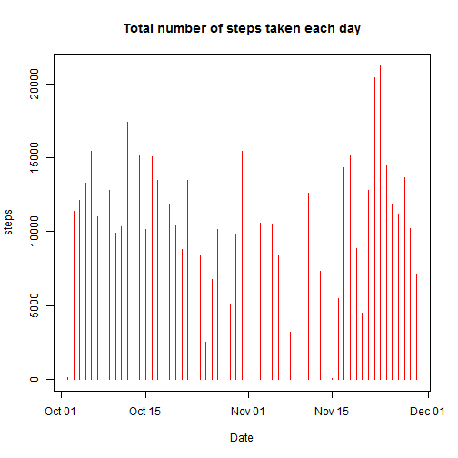
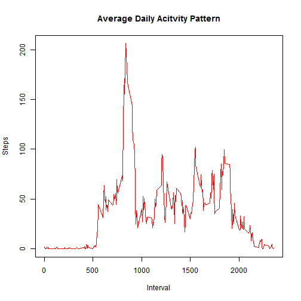
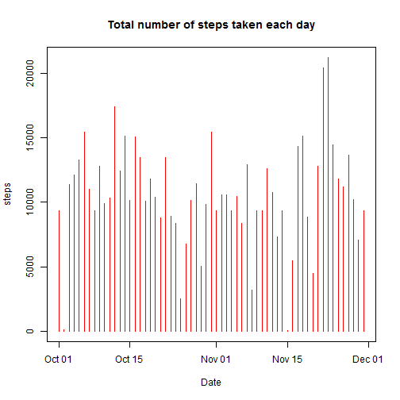
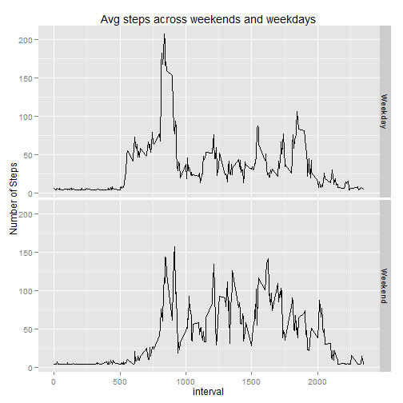

## Title: Activity.Rmd
## Author : Srini
## Date: "Aug 17, 2014"

========================================================

## 1. Loading and preprocessing of the data
#### 1.1 Load the data -  Read the input activity file

```r
act_data <- read.table("./activity.csv",header = TRUE, sep = ",")
```
#### 1.2 Process/transform the data into a format suitable for your analysis

```r
act_data$date <- as.Date(act_data$date,"%Y-%m-%d")
```
## 2. What is mean total number of steps taken per day?
#### 2.1 Make a histogram of the total number of steps taken each day

```r
act_data1 <- aggregate(steps~date,act_data,sum)
plot(act_data1$date,act_data1$steps,type = "h", col = "red", main = "Total number of steps taken each day", xlab = "Date", ylab = "steps")
```

 
#### 2.2 Calculate the mean and median of total number of steps taken per day

```r
print(mean(act_data1$steps))
```

```
## [1] 10766
```

```r
print(median(act_data1$steps))
```

```
## [1] 10765
```
## 3. What is the average daily activity pattern?
#### 3.1 Time series plot of the 5-minute interval (x-axis) and the average number of steps taken, averaged across all days (y-axis)

```r
act_data2 <- aggregate(steps ~ interval, act_data, mean )
plot(act_data2$interval, act_data2$steps, type = "l", col = "red", main = "Average Daily Acitvity Pattern", xlab = "Interval", ylab = "Steps")
```

 

#### 3.2 Which 5-minute interval, on average across all the days in the dataset contains the maximum number of steps?

```r
max_step <- act_data2[act_data2$steps == max(act_data2$steps),]
print(max_step)
```

```
##     interval steps
## 104      835 206.2
```
## 4. Imputing missing values
#### 4.1 total number of missing values in the dataset

```r
act_data <- read.table("./activity.csv",header = TRUE, sep = ",")
act_data$date <- as.Date(act_data$date,"%Y-%m-%d")
Tot_rows <- nrow(act_data)
Tot_rows_1 <- nrow(na.omit(act_data))
```
###### Total number of missing values in the dataset

```r
Tot_miss <- Tot_rows - Tot_rows_1
print(Tot_miss)
```

```
## [1] 2304
```
#### 4.2 Strategy is to calculate the avg of the steps for all the days and fill the avg value in the missing values of the dataset

```r
avgsteps <- (sum(act_data$steps,na.rm= TRUE))/ Tot_rows
```
#### 4.3 New dataset with missing data filled in with the average of the steps

```r
act_data_up <- act_data
act_data_up$date <- as.Date(act_data_up$date)
act_data_up$steps[which(is.na (act_data_up$steps) == TRUE)] <- avgsteps
```
#### 4.4 Plot Histogram for the total number of steps taken each day

```r
act_data_up1 <- aggregate(steps~date,act_data_up,sum)
plot(act_data_up1$date,act_data_up1$steps,type = "h", col = "red", main = "Total number of steps taken each day", xlab = "Date", ylab = "steps")
```

 
#### 4.4  Mean and Median of total steps taken each day

```r
print(mean(act_data_up1$steps))
```

```
## [1] 10581
```

```r
print(median(act_data_up1$steps))
```

```
## [1] 10395
```
### Conclusion : Mean and Median compared to previous estimates decreased as we have more number of observations by inserting the average number of steps to the missing data. 

## 5. Are there differences in activity patterns between weekdays and weekends?
##### 5.1 create a factor variable in the datasets to indicate if the day is weekday or weekend 

```r
act_data_up$weekday <- weekdays(as.Date(act_data_up$date))
for(i in 1:nrow(act_data_up))
     { act_data_up$daytype[i]= if(act_data_up$weekday[i] %in% c("Saturday", "Sunday")){"Weekend"}else
           {"Weekday"}      
     }
      act_data_up$weekday <- as.factor(act_data_up$weekday)
```
##### 5.2 plot containing average steps taken aggregated for 5 min interval, weekday days and weekend days.

```r
act_data_upAvg <- aggregate(act_data_up$steps,by=list(interval = act_data_up$interval,daytype = act_data_up$daytype), FUN = mean)
 
library(ggplot2)
```

```
## Warning: package 'ggplot2' was built under R version 3.1.1
```

```r
g <- ggplot(act_data_upAvg,aes(interval,x))
g + geom_line() + facet_grid(daytype~.) + labs(title = "Avg steps across weekends and weekdays") + labs(y="Number of Steps")
```

 
